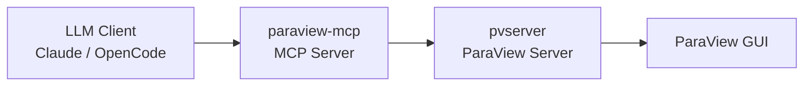

# ParaView-MCP

[](https://www.python.org/)
[](./LICENSE)
[](https://anaconda.org/conda-forge/paraview)

## Executive Summary

ParaView-MCP is an autonomous visualization agent that exposes `paraview.simple` operations as tools over the Model Context Protocol (MCP), allowing LLM clients such as Claude Desktop or OpenCode to drive a live ParaView session entirely through natural language. It bridges the gap between LLM reasoning and scientific visualization by letting the model load data, create filters, configure color maps, capture screenshots, and iterate on renderings without the user touching the ParaView GUI. The server runs alongside a `pvserver` instance and a connected ParaView GUI, forwarding every tool call through the ParaView Python API in real time. It is aimed at both domain scientists who want natural-language access to ParaView and power users who want to script complex visualization pipelines at conversational speed.

## Table of Contents

- [What is MCP?](#what-is-mcp)
- [Architecture](#architecture)
- [Prerequisites](#prerequisites)
- [Installation](#installation)
- [Development environment setup](#development-environment-setup)
- [Running](#running)
- [Integration: OpenCode](#integration-opencode)
- [Integration: Claude Code](#integration-claude-code)
- [Integration: Claude Desktop](#integration-claude-desktop)
- [MCP Tool Reference](#mcp-tool-reference)
- [Maintenance](#maintenance)
- [Troubleshooting / FAQ](#troubleshooting--faq)
- [Known Limitations](#known-limitations)
- [Contributing](#contributing)
- [Citation](#citation)
- [Authors](#authors)
- [License](#license)
- [Notice](#notice)

## What is MCP?

The [Model Context Protocol](https://modelcontextprotocol.io/) (MCP) is an open standard that defines how LLM applications discover and call external tools, resources, and prompts at runtime. By implementing an MCP server, ParaView-MCP makes every visualization operation available as a typed, discoverable tool that any compatible LLM client can invoke without custom integrations or bespoke APIs.

## Architecture



The LLM client sends tool calls to `paraview-mcp`, which translates them into `paraview.simple` Python API calls forwarded to `pvserver`, with results reflected live in the connected ParaView GUI.

## Prerequisites

- **conda** (Miniforge or Miniconda) with the `conda-forge` channel configured
- **linux-64 platform** — macOS and Windows are not supported
- **`pvserver` binary** — ships with the `conda-forge::paraview` package; no separate install needed
- **A running ParaView GUI instance** connected to the same `pvserver` (see [Running](#running))

## Installation

```bash
git clone https://github.com/NicholasSynovic/paraview_mcp.git
cd paraview_mcp
conda env create -f environment.yaml -n paraview_mcp
conda activate paraview_mcp
pip install -e .
```

The `pip install -e .` step registers the `paraview-mcp` console script and installs the `mcp` and `httpx` runtime dependencies. The `paraview` package itself is provided by conda and is intentionally absent from `pyproject.toml` (it cannot be pip-installed).

> **Python version:** the active conda env _is_ the runtime. Its Python interpreter (3.10, supplied by the pinned `paraview=5.13.3=py310...` package) is what `pip install -e .` and the `paraview-mcp` console script execute on. `.python-version` (`3.14`) and `pyproject.toml`'s `requires-python = ">=3.10"` are advisory only — they do not change the runtime interpreter.

## Development environment setup

Contributors need the runtime conda env plus the dev tooling (pre-commit, `ruff`, `uv`) declared under `[dependency-groups].dev` in `pyproject.toml`.

### One-shot setup (recommended)

From an already-installed conda (with `conda-forge` configured), run:

```bash
make create-dev
```

This Makefile target:

1. Creates or updates the `paraview_mcp` conda env from `environment.yaml` (`conda env update --file environment.yaml --prune`).
2. Installs the git pre-commit hooks inside that env (`conda run -n paraview_mcp pre-commit install`).
3. Removes any leftover `.venv/` directory and runs `uv sync --group dev` inside the conda env to install the dev dependency group.

After it finishes, activate the env and you are ready to develop:

```bash
conda activate paraview_mcp
pip install -e .          # if you have not already, registers the console script
```

### Manual setup

If you prefer to do each step by hand:

```bash
# 1. Create the conda env (provides Python 3.10, paraview 5.13.3, pvserver)
conda env create -f environment.yaml -n paraview_mcp
conda activate paraview_mcp

# 2. Editable install of paraview-mcp itself
pip install -e .

# 3. Dev tooling (pre-commit, ruff, uv) from the `dev` dependency group
uv sync --group dev

# 4. Install the git pre-commit hooks
pre-commit install
```

### Pre-commit

Pre-commit is the source of truth for formatting and linting. The configured hooks (`.pre-commit-config.yaml`) include `ruff-format`, `ruff-check`, `isort`, `bandit`, the stock `pre-commit-hooks`, and `prettier` (invoked via `bunx`, so you also need [`bun`](https://bun.sh) installed for the prettier hook to run).

Run all hooks across the repo with:

```bash
pre-commit run --all-files
```

### Updating `environment.yaml`

After adding or removing packages in the conda env, regenerate the pin file with:

```bash
make freeze
```

This runs `conda env export -n paraview_mcp` (stripped of the machine-specific `prefix:` line) and writes it to `environment.yaml`. **Manually verify** afterwards that:

1. `channels:` still lists `conda-forge` and `nodefaults` (in that order).
2. The `pip:` section does **not** contain a self-reference to `paraview-mcp` — `conda env export` will include the editable install; delete that entry before committing.

### Building a release artifact

`make build` packages the project for distribution:

```bash
make build
```

It clears `dist/`, sets the project version from the latest git tag via `uv version`, runs `uv build`, and reinstalls the resulting sdist with `uv pip install dist/*.tar.gz`. A git tag must already exist for the version-setting step to succeed.

## Running

Follow these three steps **in order**:

**1. Start `pvserver`** (in a separate terminal, inside the activated conda env):

```bash
pvserver --multi-clients --server-port=11111
```

**2. Connect the ParaView GUI** to the running server:

Open ParaView → **File → Connect** → add a server at `localhost:11111` → click **Connect**.

**3. Start the MCP server**:

`paraview-mcp` requires an engine subcommand (`v1`, `v2`, or `v3`). Use `v1` for the current engine:

```bash
paraview-mcp v1 --paraview-server localhost --paraview-port 11111
```

`--paraview-server` (default `localhost`) and `--paraview-port` (default `11111`) select the `pvserver` to connect to, so the bare `paraview-mcp v1` form works against a default local server.

### V2 engine (streamable-http transport)

The `v2` engine exposes the same tools as `v1` but serves them over the MCP
**streamable-http** transport instead of stdio. This lets a remote MCP client
connect to a long-running server over the network.

```bash
paraview-mcp v2 --paraview-server localhost --paraview-port 11111 --server localhost --port 8080
```

The two address pairs are distinct:

| Flag                                    | Default               | Description                                             |
| --------------------------------------- | --------------------- | ------------------------------------------------------- |
| `--paraview-server` / `--paraview-port` | `localhost` / `11111` | The `pvserver` the engine connects to.                  |
| `--server` / `--port`                   | `localhost` / `8080`  | The address the MCP streamable-http transport binds to. |

The streamable-http endpoint is served at `http://<server>:<port>/mcp`. Point a
remote-capable MCP client at that URL (see the OpenCode example below).

### V3 engine (single `execute_code` tool)

The `v3` engine is intentionally minimal: it exposes a **single** tool,
`execute_code`, instead of the 39 tools shared by `v1`/`v2`. The tool ships a
Python source string to the connected `pvserver`, where it is run as the
`Script` of a reused `ProgrammableSource` (executed server-side by
`UpdatePipeline()`). The script runs in the Programmable Source sandbox (e.g.
`self`, `output`, `vtk`), **not** a full `paraview.simple` session, and its
printed output is not captured — `execute_code` returns only a success or
error message. Like `v2`, it serves over streamable-http and takes the same
`--server` / `--port` bind options.

```bash
paraview-mcp v3 --paraview-server localhost --paraview-port 11111 --server localhost --port 8080
```

> v3's `execute_code` is not listed in the MCP Tool Reference table below
> (that table covers the shared `v1`/`v2` tool set defined in
> `paraview_mcp/tools.py`).

### External ParaView install

If ParaView is installed outside the active conda env (e.g., a system or custom build), point the server at its site-packages:

```bash
paraview-mcp v1 --paraview-package-path /opt/paraview/lib/python3.x/site-packages
```

### Screenshot compression

Screenshots returned by `get_screenshot` are compressed by default to reduce LLM token usage. The defaults can be configured with global CLI flags (available on every engine subcommand):

```bash
paraview-mcp v1 --no-compress-screenshots
paraview-mcp v1 --max-screenshot-width 1920 --screenshot-quality 70
```

| Flag                                                   | Default    | Description                                                        |
| ------------------------------------------------------ | ---------- | ------------------------------------------------------------------ |
| `--compress-screenshots` / `--no-compress-screenshots` | `compress` | Toggle JPEG screenshot compression.                                |
| `--max-screenshot-width`                               | `1280`     | Maximum screenshot width in pixels (height scales proportionally). |
| `--screenshot-quality`                                 | `85`       | JPEG quality (1-100) when compression is enabled.                  |

These set the startup defaults; they can still be overridden at runtime via the `configure_screenshot_compression` tool.

## Integration: OpenCode

Add the following to `~/.config/opencode/opencode.json`:

```json
{
    "mcp": {
        "paraview": {
            "type": "local",
            "command": [
                "paraview-mcp",
                "v1",
                "--paraview-server",
                "localhost",
                "--paraview-port",
                "11111"
            ]
        }
    }
}
```

Or use the provided config like so:

```bash
OPENCODE_CONFIG=opencode-config.json opencode
```

To use the `v2` engine instead, start the server separately
(`paraview-mcp v2 --server localhost --port 8080`) and register it as a
`remote` MCP pointing at the streamable-http endpoint:

```json
{
    "mcp": {
        "paraview": {
            "type": "remote",
            "url": "http://localhost:8080/mcp"
        }
    }
}
```

## Integration: Claude Code

Add the following to `.mcp.json` in your project root (or `~/.claude/mcp.json` for a global config):

```json
{
    "mcpServers": {
        "paraview": {
            "command": "paraview-mcp",
            "args": [
                "v1",
                "--paraview-server",
                "localhost",
                "--paraview-port",
                "11111"
            ]
        }
    }
}
```

## Integration: Claude Desktop

Add the following block to `claude_desktop_config.json`:

```json
{
    "mcpServers": {
        "ParaView": {
            "command": "paraview-mcp",
            "args": [
                "v1",
                "--paraview-server",
                "localhost",
                "--paraview-port",
                "11111"
            ]
        }
    }
}
```

## MCP Tool Reference

All tools are defined once in `paraview_mcp/tools.py` as `@mcp.tool()` functions and delegate to `ParaViewManager` methods. Both the v1 (stdio) and v2 (streamable-http) engines import the same `mcp` instance and tool set from that module; `paraview_mcp/v1/pv_mcp.py` and `paraview_mcp/v2/pv_mcp.py` are thin `run()` shims that differ only in transport. Use `list_commands` to discover them at runtime (it is generated from the registered tools, so it never drifts).

### Connection

| Tool                                   | Description                                                                              |
| -------------------------------------- | ---------------------------------------------------------------------------------------- |
| _(connection is automatic on startup)_ | `paraview-mcp` connects to `pvserver` when launched; no explicit connect tool is needed. |

### Data Sources

| Tool            | Description                                                         |
| --------------- | ------------------------------------------------------------------- |
| `load_data`     | Load a data file into ParaView (VTK, EXODUS, CSV, RAW, and more).   |
| `create_source` | Create a new geometric source (Sphere, Cone, Cylinder, Plane, Box). |

### Filters

| Tool                   | Description                                                              |
| ---------------------- | ------------------------------------------------------------------------ |
| `create_isosurface`    | Generate an isosurface (contour) at a given scalar value.                |
| `create_slice`         | Slice the active volume with a plane defined by origin and normal.       |
| `create_streamline`    | Trace streamlines through a vector field using the StreamTracer filter.  |
| `warp_by_vector`       | Apply the Warp By Vector filter to deform geometry along a vector field. |
| `plot_over_line`       | Sample data values along a line between two points.                      |
| `compute_surface_area` | Compute the surface area of the currently active dataset.                |

### Visualization / Color

| Tool                      | Description                                                                 |
| ------------------------- | --------------------------------------------------------------------------- |
| `toggle_volume_rendering` | Show or hide volume rendering for the active source.                        |
| `toggle_visibility`       | Show or hide the active source without changing its representation.         |
| `set_representation_type` | Switch between Surface, Wireframe, Points, and other representations.       |
| `color_by`                | Color the active visualization by a named scalar or vector field.           |
| `set_color_map`           | Define a custom RGB color transfer function for a field (volume rendering). |
| `edit_volume_opacity`     | Edit the opacity transfer function for a scalar field (volume rendering).   |

### Camera

| Tool            | Description                                               |
| --------------- | --------------------------------------------------------- |
| `rotate_camera` | Rotate the camera by azimuth and/or elevation angles.     |
| `reset_camera`  | Reset the camera to fit all visible data in the viewport. |

### Export

| Tool                  | Description                                                                |
| --------------------- | -------------------------------------------------------------------------- |
| `save_contour_as_stl` | Save the active surface or contour as an STL file.                         |
| `get_screenshot`      | Capture a screenshot of the current viewport and return it inline in chat. |

### Utility

| Tool                              | Description                                                         |
| --------------------------------- | ------------------------------------------------------------------- |
| `get_pipeline`                    | Return a description of the current pipeline hierarchy.             |
| `get_available_arrays`            | List the scalar and vector arrays available on the active source.   |
| `set_active_source`               | Set the active pipeline object by its registered name.              |
| `get_active_source_names_by_type` | List pipeline sources filtered by type (e.g., `Contour`, `Sphere`). |
| `list_commands`                   | Print all available MCP tool names and one-line descriptions.       |

## Maintenance

### Updating pinned conda dependencies

Use `make freeze` and verify the result as described in [Updating `environment.yaml`](#updating-environmentyaml) under the development setup section. Commit the updated `environment.yaml` so the pinned environment stays reproducible.

## Troubleshooting / FAQ

**1. `ModuleNotFoundError: No module named 'paraview'`**

`paraview` is only installable via conda, not pip. Activate the conda env (`conda activate paraview_mcp`) before running `paraview-mcp`. Alternatively, if ParaView is installed outside the env, pass `--paraview-package-path /path/to/site-packages`.

**2. `ConnectionRefusedError` on port 11111**

`pvserver` must be started before `paraview-mcp`. Run `pvserver --multi-clients --server-port=11111` in a separate terminal first, then start the MCP server.

**3. ParaView GUI shows blank or incorrect content**

This is a known issue related to pvserver-sync deprecation in recent ParaView versions. See [Known Limitations](#known-limitations) for details.

**4. Where are the logs?**

Log output is written to `~/paraview_logs/paraview_mcp_external.log`. The directory is created automatically on first import of `paraview_mcp.main`.

**5. `paraview-mcp: command not found`**

The console script is registered by `pip install -e .`. Run that command from the repo root (inside the conda env) and retry.

## Known Limitations

> The current implementation of the connection between the MCP server and ParaView, in both the main and dev branches, relies on synchronization between pvserver and the ParaView client. Because this feature has been deprecated in most recent ParaView versions, the ParaView application view may not display content from the pvserver instance correctly, and overall stability issues may occur.

## Contributing

See [CONTRIBUTING.md](./CONTRIBUTING.md) for guidelines on pull requests, branch naming, commit style, and the code of conduct.

## Citation

If you use ParaView-MCP in published work, please cite:

S. Liu, H. Miao, and P.-T. Bremer, "Paraview-MCP: Autonomous Visualization Agents with Direct Tool Use," in _Proc. IEEE VIS 2025 Short Papers_, 2025, pp. 00.

```bibtex
@inproceedings{liu2025paraview,
  title={Paraview-MCP: Autonomous Visualization Agents with Direct Tool Use},
  author={Liu, S. and Miao, H. and Bremer, P.-T.},
  booktitle={Proc. IEEE VIS 2025 Short Papers},
  pages={00},
  year={2025},
  organization={IEEE}
}
```

## Authors

ParaView-MCP was created by Shusen Liu (<liu42@llnl.gov>) and Haichao Miao (<miao1@llnl.gov>).

Current maintainer of this fork: [Nicholas Synovic](https://github.com/NicholasSynovic).

## License

ParaView-MCP is distributed under the terms of the BSD-3-Clause license. See [LICENSE](./LICENSE) for the full text.

## Notice

Third-party attributions are recorded in [NOTICE](./NOTICE).
