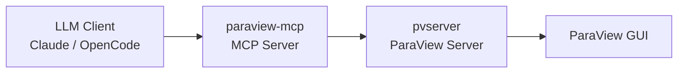

# ParaView-MCP

[](https://www.python.org/)
[](./LICENSE)
[](https://anaconda.org/conda-forge/paraview)

## Executive Summary

ParaView-MCP is an autonomous visualization agent that exposes `paraview.simple` operations as tools over the Model Context Protocol (MCP), allowing LLM clients such as Claude Desktop or OpenCode to drive a live ParaView session entirely through natural language. It bridges the gap between LLM reasoning and scientific visualization by letting the model load data, create filters, configure color maps, capture screenshots, and iterate on renderings without the user touching the ParaView GUI. The server runs alongside a `pvserver` instance and a connected ParaView GUI, forwarding every tool call through the ParaView Python API in real time. It is aimed at both domain scientists who want natural-language access to ParaView and power users who want to script complex visualization pipelines at conversational speed.

## Table of Contents

- [What is MCP?](#what-is-mcp)
- [Architecture](#architecture)
- [Prerequisites](#prerequisites)
- [Installation](#installation)
- [Running](#running)
- [Integration: OpenCode](#integration-opencode)
- [Integration: Claude Code](#integration-claude-code)
- [Integration: Claude Desktop](#integration-claude-desktop)
- [MCP Tool Reference](#mcp-tool-reference)
- [Maintenance](#maintenance)
- [Troubleshooting / FAQ](#troubleshooting--faq)
- [Known Limitations](#known-limitations)
- [Contributing](#contributing)
- [Citation](#citation)
- [Authors](#authors)
- [License](#license)
- [Notice](#notice)

## What is MCP?

The [Model Context Protocol](https://modelcontextprotocol.io/) (MCP) is an open standard that defines how LLM applications discover and call external tools, resources, and prompts at runtime. By implementing an MCP server, ParaView-MCP makes every visualization operation available as a typed, discoverable tool that any compatible LLM client can invoke without custom integrations or bespoke APIs.

## Architecture



The LLM client sends tool calls to `paraview-mcp`, which translates them into `paraview.simple` Python API calls forwarded to `pvserver`, with results reflected live in the connected ParaView GUI.

## Prerequisites

- **conda** (Miniforge or Miniconda) with the `conda-forge` channel configured
- **linux-64 platform** — macOS and Windows are not supported
- **`pvserver` binary** — ships with the `conda-forge::paraview` package; no separate install needed
- **A running ParaView GUI instance** connected to the same `pvserver` (see [Running](#running))

## Installation

```bash
git clone https://github.com/NicholasSynovic/paraview_mcp.git
cd paraview_mcp
conda env create -f environment.yaml -n paraview_mcp
conda activate paraview_mcp
pip install -e .
```

The `pip install -e .` step registers the `paraview-mcp` console script and installs the `mcp` and `httpx` runtime dependencies. The `paraview` package itself is provided by conda and is intentionally absent from `pyproject.toml` (it cannot be pip-installed).

### Developer install

For contributors who need pre-commit hooks, `uv`, and `ruff`:

```bash
uv sync --group dev
```

## Running

Follow these three steps **in order**:

**1. Start `pvserver`** (in a separate terminal, inside the activated conda env):

```bash
pvserver --multi-clients --server-port=11111
```

**2. Connect the ParaView GUI** to the running server:

Open ParaView → **File → Connect** → add a server at `localhost:11111` → click **Connect**.

**3. Start the MCP server**:

```bash
paraview-mcp --server localhost --port 11111
```

### External ParaView install

If ParaView is installed outside the active conda env (e.g., a system or custom build), point the server at its site-packages:

```bash
paraview-mcp --paraview_package_path /opt/paraview/lib/python3.x/site-packages
```

## Integration: OpenCode

Add the following to `~/.config/opencode/opencode.json`:

```json
{
    "mcp": {
        "paraview": {
            "type": "local",
            "command": [
                "paraview-mcp",
                "--server",
                "localhost",
                "--port",
                "11111"
            ]
        }
    }
}
```

Or use the provided config like so:

```bash
OPENCODE_CONFIG=opencode-config.json opencode
```

## Integration: Claude Code

Add the following to `.mcp.json` in your project root (or `~/.claude/mcp.json` for a global config):

```json
{
    "mcpServers": {
        "paraview": {
            "command": "paraview-mcp",
            "args": ["--server", "localhost", "--port", "11111"]
        }
    }
}
```

## Integration: Claude Desktop

Add the following block to `claude_desktop_config.json`:

```json
{
    "mcpServers": {
        "ParaView": {
            "command": "paraview-mcp",
            "args": ["--server", "localhost", "--port", "11111"]
        }
    }
}
```

## MCP Tool Reference

All tools are defined in `paraview_mcp/main.py` as `@mcp.tool()` functions and delegate to `ParaViewManager` methods. Use `list_commands` to discover them at runtime.

### Connection

| Tool                                   | Description                                                                              |
| -------------------------------------- | ---------------------------------------------------------------------------------------- |
| _(connection is automatic on startup)_ | `paraview-mcp` connects to `pvserver` when launched; no explicit connect tool is needed. |

### Data Sources

| Tool            | Description                                                         |
| --------------- | ------------------------------------------------------------------- |
| `load_data`     | Load a data file into ParaView (VTK, EXODUS, CSV, RAW, and more).   |
| `create_source` | Create a new geometric source (Sphere, Cone, Cylinder, Plane, Box). |

### Filters

| Tool                   | Description                                                              |
| ---------------------- | ------------------------------------------------------------------------ |
| `create_isosurface`    | Generate an isosurface (contour) at a given scalar value.                |
| `create_slice`         | Slice the active volume with a plane defined by origin and normal.       |
| `create_streamline`    | Trace streamlines through a vector field using the StreamTracer filter.  |
| `warp_by_vector`       | Apply the Warp By Vector filter to deform geometry along a vector field. |
| `plot_over_line`       | Sample data values along a line between two points.                      |
| `compute_surface_area` | Compute the surface area of the currently active dataset.                |

### Visualization / Color

| Tool                      | Description                                                                 |
| ------------------------- | --------------------------------------------------------------------------- |
| `toggle_volume_rendering` | Show or hide volume rendering for the active source.                        |
| `toggle_visibility`       | Show or hide the active source without changing its representation.         |
| `set_representation_type` | Switch between Surface, Wireframe, Points, and other representations.       |
| `color_by`                | Color the active visualization by a named scalar or vector field.           |
| `set_color_map`           | Define a custom RGB color transfer function for a field (volume rendering). |
| `edit_volume_opacity`     | Edit the opacity transfer function for a scalar field (volume rendering).   |

### Camera

| Tool            | Description                                               |
| --------------- | --------------------------------------------------------- |
| `rotate_camera` | Rotate the camera by azimuth and/or elevation angles.     |
| `reset_camera`  | Reset the camera to fit all visible data in the viewport. |

### Export

| Tool                  | Description                                                                |
| --------------------- | -------------------------------------------------------------------------- |
| `save_contour_as_stl` | Save the active surface or contour as an STL file.                         |
| `get_screenshot`      | Capture a screenshot of the current viewport and return it inline in chat. |

### Utility

| Tool                              | Description                                                         |
| --------------------------------- | ------------------------------------------------------------------- |
| `get_pipeline`                    | Return a description of the current pipeline hierarchy.             |
| `get_available_arrays`            | List the scalar and vector arrays available on the active source.   |
| `set_active_source`               | Set the active pipeline object by its registered name.              |
| `get_active_source_names_by_type` | List pipeline sources filtered by type (e.g., `Contour`, `Sphere`). |
| `list_commands`                   | Print all available MCP tool names and one-line descriptions.       |

## Maintenance

### Updating pinned conda dependencies

After adding or removing packages from the conda env, regenerate `environment.yaml`:

```bash
conda env export -n paraview_mcp | grep -v "^prefix:" > environment.yaml
```

Then open `environment.yaml` and manually verify:

1. `channels:` lists `conda-forge` and `nodefaults` (in that order).
2. The `pip:` section does **not** include a self-reference to `paraview-mcp` (remove the editable install entry before committing).

Commit the updated `environment.yaml` so the pinned environment is reproducible.

## Troubleshooting / FAQ

**1. `ModuleNotFoundError: No module named 'paraview'`**

`paraview` is only installable via conda, not pip. Activate the conda env (`conda activate paraview_mcp`) before running `paraview-mcp`. Alternatively, if ParaView is installed outside the env, pass `--paraview_package_path /path/to/site-packages`.

**2. `ConnectionRefusedError` on port 11111**

`pvserver` must be started before `paraview-mcp`. Run `pvserver --multi-clients --server-port=11111` in a separate terminal first, then start the MCP server.

**3. ParaView GUI shows blank or incorrect content**

This is a known issue related to pvserver-sync deprecation in recent ParaView versions. See [Known Limitations](#known-limitations) for details.

**4. Where are the logs?**

Log output is written to `~/paraview_logs/paraview_mcp_external.log`. The directory is created automatically on first import of `paraview_mcp.main`.

**5. `paraview-mcp: command not found`**

The console script is registered by `pip install -e .`. Run that command from the repo root (inside the conda env) and retry.

## Known Limitations

> The current implementation of the connection between the MCP server and ParaView, in both the main and dev branches, relies on synchronization between pvserver and the ParaView client. Because this feature has been deprecated in most recent ParaView versions, the ParaView application view may not display content from the pvserver instance correctly, and overall stability issues may occur.

## Contributing

See [CONTRIBUTING.md](./CONTRIBUTING.md) for guidelines on pull requests, branch naming, commit style, and the code of conduct.

## Citation

If you use ParaView-MCP in published work, please cite:

S. Liu, H. Miao, and P.-T. Bremer, "Paraview-MCP: Autonomous Visualization Agents with Direct Tool Use," in _Proc. IEEE VIS 2025 Short Papers_, 2025, pp. 00.

```bibtex
@inproceedings{liu2025paraview,
  title={Paraview-MCP: Autonomous Visualization Agents with Direct Tool Use},
  author={Liu, S. and Miao, H. and Bremer, P.-T.},
  booktitle={Proc. IEEE VIS 2025 Short Papers},
  pages={00},
  year={2025},
  organization={IEEE}
}
```

## Authors

ParaView-MCP was created by Shusen Liu (<liu42@llnl.gov>) and Haichao Miao (<miao1@llnl.gov>).

Current maintainer of this fork: [Nicholas Synovic](https://github.com/NicholasSynovic).

## License

ParaView-MCP is distributed under the terms of the BSD-3-Clause license. See [LICENSE](./LICENSE) for the full text.

## Notice

Third-party attributions are recorded in [NOTICE](./NOTICE).
